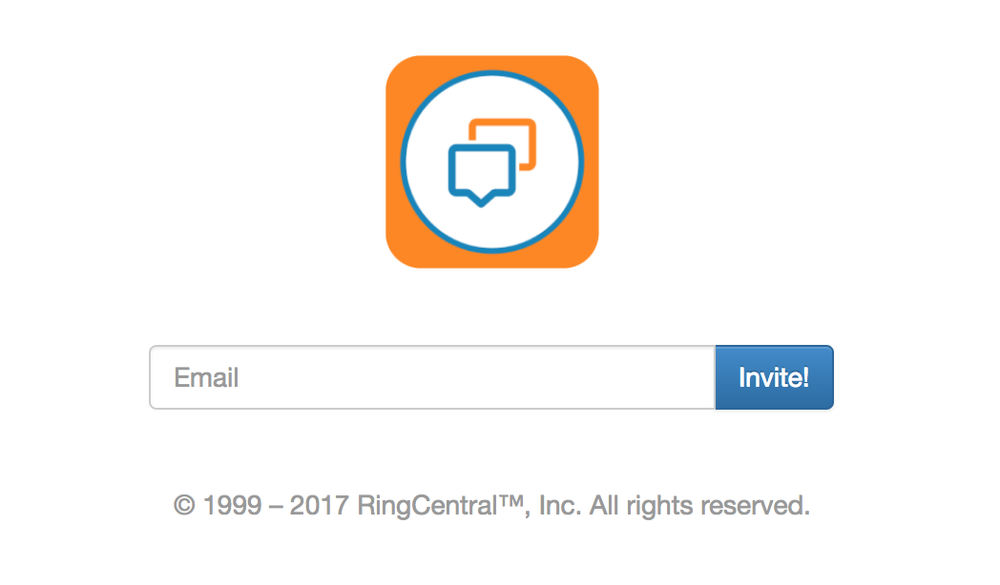

[](https://travis-ci.org/anilkumarbp/Glipped)
[]()
[](https://opensource.org/licenses/MIT)
[](http://localhost:8080/)
 
# Glipped

A simple Express Server App to invite users to Glip Groups.

# Features
- A landing page you can point users to fill in their
  emails and receive an invite into the `Glip` group.
- A SVG badge that works well from static mediums
  (like GitHub README pages)

 
## Requirement

* Node - 7.4.0  
* Express - 4.11.xx 


## Installation via NPM

```bash
$ cd glipped
$ npm install
```

## Run the Program

```bash
$ cp config-sample.env.txt .env
$ vi .env
```
Enter the indicated values :

## .env
    * **GLIP_APP_KEY=** Your application's `app_key`
    * **GLIP_APP_SECRET=** Your application's `app_secret`
    * **GLIP_APP_SERVER_URL=** Either `sandbox` -OR- `production`
    * **GLIP_USERNAME=** Glip User's `phone-number`
    * **GLIP_EXTENSION=** Glip User's `extension`
    * **GLIP_PASSWORD=** Glip User's `password`
    * **GLIP_LOGO=** Organizations's `logo` ( a http / https link to the Logo )
    * **GLIP_GROUP_NAME=** Organization's `name`
    * **GLIP_GROUP_ID=** Group ID of the glip `group`
    
** To GET the `groupId` of the group please ref to [Get Group List](https://developer.ringcentral.com/api-explorer/latest/index.html#/!/Glip_API/loadGroupList);    

## Operation

To start this application locally:
```
npm start
```

To run the unit tests:
```
npm test
```


** Application would be started on port 8080 ( http://localhost:8080 )

### SVG

[](http://localhost:8080/)

```html

```

Done in Markdown this looks like:

    [](http://localhost:8080/)

### Landing page



Point to `http://localhost:8080/`.

**Note:** the image for the logo of the landing page
is retrieved from the `RC_LOGO` parameter specified in the .ENV file. If you do not provide the `URL` in the `.ENV` file, it won't be shown.

## To run the unit tests:

```
npm test
```

## Dependencies

Current used RCSDK version for this demo is :
[ "ringcentral": "^3.1.1"](https://github.com/ringcentral/ringcentral-js/tree/3.1.1)
* Make sure to change the SDK version in the package.json before you chose to use a different SDK Version.


## Links

Project Repo

* https://github.com/anilkumarbp/Glipped

RingCentral SDK for JavaScript

* https://github.com/ringcentral/ringcentral-js

RingCentral API Docs

* https://developer.ringcentral.com/api-and-docs.html

RingCentral API Explorer

* https://developer.ringcentral.com/api-explorer/latest/index.html

## Contributions

Any reports of problems, comments or suggestions are most welcome.

Please report these on [Glipped's Issue Tracker in Github](https://github.com/anilkumarbp/Glipped/issues).

## License

RingCentral SDK is available under an MIT-style license. See [LICENSE.txt](LICENSE.txt) for details.

RingCentral SDK &copy; 2017 by RingCentral

## FAQ

* What if I do not have a RingCentral account? Don't have an account, no worries: [Become a RingCentral Customer](https://www.ringcentral.com/office/plansandpricing.html)
* I/My company is an Independent Software Vendor (ISV) who would like to integrate with RingCentral, how do I do that? You can apply to [Join the RingCentral Partner Program](http://www.ringcentral.com/partner/isvreseller.html)